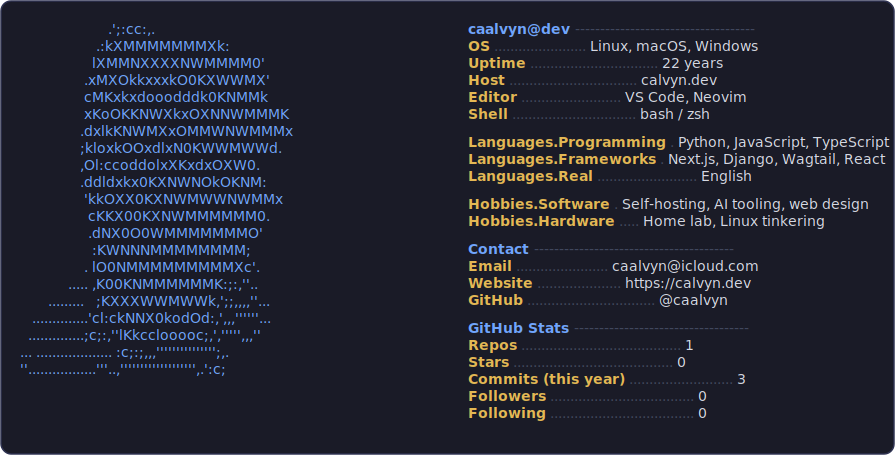

<!--
  This README lives in the repo caalvyn/caalvyn and renders on your profile.
  The SVGs are regenerated daily by .github/workflows/update.yml.
  Edit your info in generate.py (the PROFILE dict), not here.
-->

  <picture>
    <source media="(prefers-color-scheme: dark)" srcset="./dark_mode.svg" />
    <source media="(prefers-color-scheme: light)" srcset="./light_mode.svg" />
    
  </picture>

  <a href="https://calvyn.dev">website</a> &nbsp;•&nbsp;
  <a href="mailto:caalvyn@icloud.com">email</a> &nbsp;•&nbsp;
  

